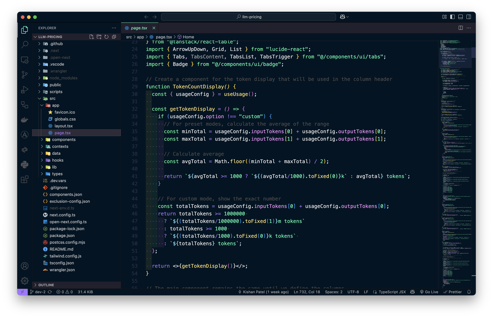
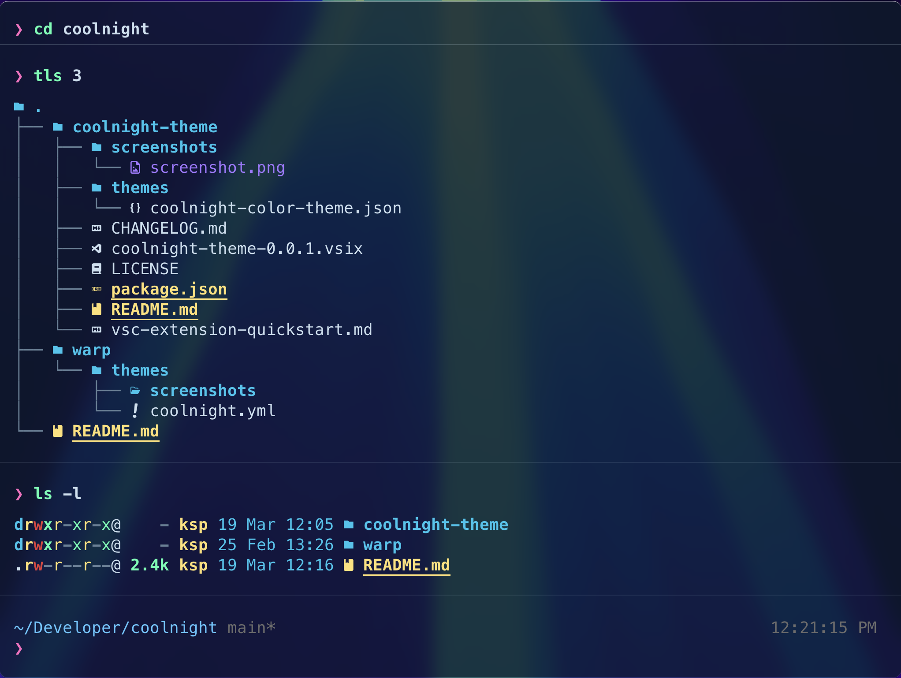

# Coolnight Theme for Warp Terminal, VSCode, OpenChamber, OpenCode, and T3 Code

<div align="center">
   

   
</div>

## Description

This repository contains the Coolnight theme for Warp Terminal, Visual Studio Code, OpenChamber, OpenCode, and T3 Code. Originally created by [Josean](https://github.com/josean-dev) for Alacritty, WezTerm, and iTerm2, this theme has been extended to enhance your coding experience across these additional environments.

Each port includes **Coolnight** (dark) and **Coolnight Light**.

## Installation

### Visual Studio Code

1. Open the Extensions view in VSCode (`Ctrl + Shift + X` or `⌘ + Shift + X` on macOS).

2. Search for the [Coolnight Theme](https://marketplace.visualstudio.com/items?itemName=kpatdev.coolnight-theme) in the Extensions Marketplace and install it.

3. Apply the theme:
   - Go to `Preferences` > `Color Theme` (`Ctrl + K` followed by `Ctrl + T` or `⌘ + K` followed by `⌘ + T` on macOS).
   - Select `Coolnight` or `Coolnight Light` from the list.

### Warp Terminal

1. Clone this repository:

   ```bash
   git clone https://github.com/kpatdev/coolnight.git
   cd coolnight
   ```

2. Copy the Warp theme files:

   ```bash
   cp warp/themes/coolnight.yml warp/themes/coolnight-light.yml ~/.warp/themes
   ```

3. Load the theme in Warp:
   - Open Warp Terminal.
   - Go to ⚙️ Settings > Appearance > Themes.
   - Find and select `Coolnight` or `Coolnight Light` from the list.
   - Optional: enable **Sync with OS** and assign Coolnight to dark mode and Coolnight Light to light mode.

### OpenChamber

1. Create the OpenChamber themes directory:

   ```bash
   mkdir -p ~/.config/openchamber/themes
   ```

2. Copy the OpenChamber theme files:

   ```bash
   cp openchamber/themes/coolnight.json openchamber/themes/coolnight-light.json ~/.config/openchamber/themes/
   ```

3. Load the theme in OpenChamber:
   - Go to `Settings` > `Theme` > `Reload themes`.
   - Select `Coolnight` or `Coolnight Light` from the theme dropdown.

### OpenCode

1. Create the OpenCode themes directory:

   ```bash
   mkdir -p ~/.config/opencode/themes
   ```

2. Copy the OpenCode theme file:

   ```bash
   cp opencode/themes/coolnight.json ~/.config/opencode/themes/
   ```

3. Load the theme in OpenCode:
   - Run `/theme` and select `coolnight`.
   - Or set it in `tui.json` with `"theme": "coolnight"`.
   - The theme follows OpenCode's dark/light appearance.

### T3 Code

1. Clone this repository:

   ```bash
   git clone https://github.com/kpatdev/coolnight.git
   cd coolnight
   ```

2. Copy the contents of `t3code/themes/coolnight.json`.

3. In T3 Code, open **Settings → Themes → Import theme**, paste the JSON, and confirm.

The imported theme includes both dark and light variants and follows T3 Code's appearance setting.

## Contributing

> **Note**  
> This theme is still a work in progress and was put together pretty quickly. If you encounter any issues or have suggestions, please feel free to open an issue in the repository.

Contributions are welcome! Please feel free to submit a Pull Request.

## License

This project is licensed under the MIT License - see the [LICENSE](LICENSE) file for details.

## Acknowledgments

- Huge thanks to Josean for the original Coolnight colorscheme for Alacritty, WezTerm, and iTerm2
- Inspired by the aesthetic and functional beauty of the Aura theme
