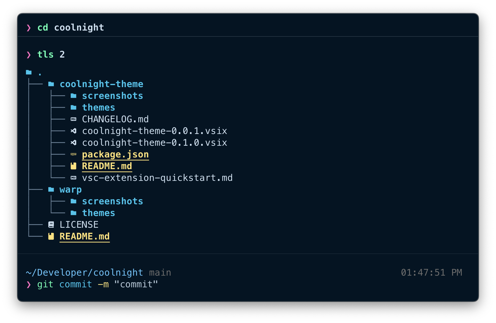

# Coolnight Theme for Warp Terminal and VSCode

<div align="center">
   

   
</div>

## Description

This repository contains the Coolnight theme for Warp Terminal and Visual Studio Code. Originally created by [Josean](https://github.com/josean-dev) for Alacritty, WezTerm, and iTerm2, this theme has been extended to enhance your coding experience across these additional environments.

## Installation

### Visual Studio Code

1. Open the Extensions view in VSCode (`Ctrl + Shift + X` or `⌘ + Shift + X` on macOS).

2. Search for the [Coolnight Theme](https://marketplace.visualstudio.com/items?itemName=kpatdev.coolnight-theme) in the Extensions Marketplace and install it.

3. Apply the theme:
   - Go to `Preferences` > `Color Theme` (`Ctrl + K` followed by `Ctrl + T` or `⌘ + K` followed by `⌘ + T` on macOS).
   - Select `Coolnight` from the list.

### Warp Terminal

1. Clone this repository:

   ```bash
   git clone https://github.com/kpatdev/coolnight.git
   cd coolnight
   ```

2. Copy the Warp theme file:

   ```bash
   cp warp/themes/coolnight.yml ~/.warp/themes
   ```

3. Load the theme in Warp:
   - Open Warp Terminal.
   - Go to ⚙️ Settings > Appearance > Themes.
   - Find and select `Coolnight` from the list.

## Contributing

> **Note**  
> This theme is still a work in progress and was put together pretty quickly. If you encounter any issues or have suggestions, please feel free to open an issue in the repository.

Contributions are welcome! Please feel free to submit a Pull Request.

## License

This project is licensed under the MIT License - see the [LICENSE](LICENSE) file for details.

## Acknowledgments

- Huge thanks to Josean for the original Coolnight colorscheme for Alacritty, WezTerm, and iTerm2
- Inspired by the aesthetic and functional beauty of the Aura theme
